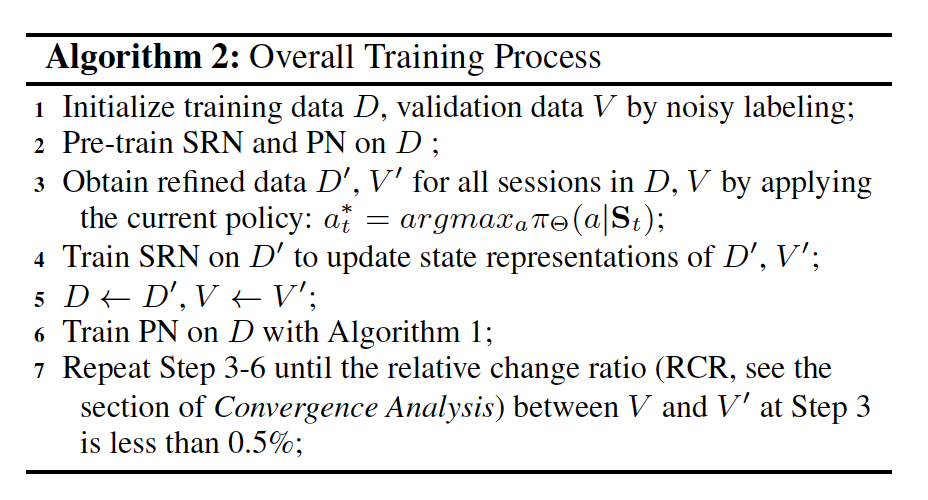
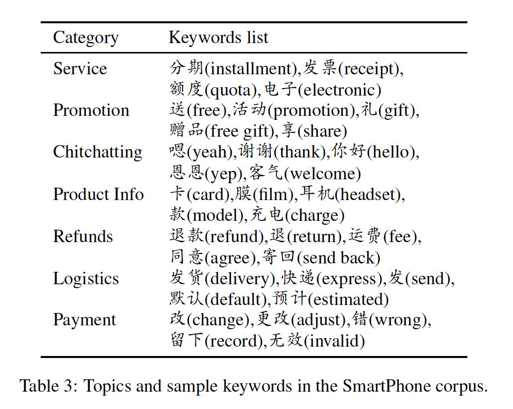

# A Weakly Supervised Method for Topic Segmentation and Labeling in Goal-oriented Dialogues via Reinforcement Learning(2018)

## 용어

* dialugue session: 전체 대화문
* dialugue utterance: 전체 대화문을 구성하고 있는 대화문 segment

## Abstract

* 대화 발화문에서 topic boundary를 찾고, 해당 발화문에 topic label을 부여하기 위해 강화학습을 사용한 topic segmentation과 goal-oriented dialogues를 라벨링하는 기법을 제안한다.
* goal-oriented customer service dialogue에는 세가지의 issue가 존재한다.
  * informality
  * local topic continuity
  * global topic structure
* Weakly supervised setting에서 해당 task를 살펴보고, sequential decision problem으로 공식화 시켰다.
* 1) informality issue를 위한 state representation network와 2) local topic continuiuty와 global topic structure 모델에 대한 reward를 부여하는 policy network로 구성된다.
  * 두가지 네트워크를 학습하고, policy에 대해 warm-start를 할 수 있도록 
    * 자동으로 데이터의 keyword를 annotate
  * 그런 다음 noisy data로 네트워크를 pre-train
  * 더 좋은 policy를 얻기 위한 state representation을 찾아내기 위해 current policy로 데이터를 refine하는 작업을 계속 진행한다.
* Sota baseline보다 본 논문의 weakly supervised 방법이 더 좋음을 실험으로 밝혔다.

## 1. Introduction

* 발화의 토픽 boundaty를 찾고, 각 발화마다 토픽 라벨을 할당하기 위해 Goal-oriented dialogue의 토픽 구조를 분석하는 것을 목표로 한다.
* 다른 일반 텍스트들에 비해 goal-oriented dialogue는 다음과 같은 세가지 특징을 가진다:
  * **informality**: 단편화되거나 불완전하거나 오타나 구어체가 포함된 문장
  * **local topic continuity**:  하나의 문제에 대해 얘기를 진행할 때는 대부분 하나의 토픽에 대해서만 얘기한다.
  * **global topic structure**: 각 dialogue 세션은 딱 떨어지는 boundary를 가지고 있으며, 토픽 간 cross-transition은 적고 cohesion은 높은 특징을 지닌다.
* 하지만 기존의 방법들은 위의 특징들을 제대로 반영하지 못하고 있다.
  * local topic continuiuty를 해결하기 위해 기존에는 어휘적 cohesion이나 phrase similarity를 이용해 왔다.
    * 문장 레벨의 dependency를 고려하지 못하고, 문맥을 제대로 요약하지 못한다.
    * 응집된 local topic assignment를 만들 수 없으며 fragmented segment를 만들어낸다.
  * 인접한 발언들 간 discourse dependency를 알아내기 위한 연구도 있었지만, 다이얼로그 시스템에서 global topic structure를 모델링 하는 것은 아직까지 연구된 적이 없음.
  * Fully supervised method들은 annotation을 진행하는 비용이 너무 크기 때문에 큰 데이터셋에는 적합하지 않음.
* 따라서 이 논문에서는 policy gradient reinforcement learning을 이용해 위의 세가지 특징을 고려하는 방법을 제안함.
  * topic segmentation과 labeling을 sequential decision problem으로 봄
    * 각 발언에 대해 sequential하게 토픽을 부여
    * 이전의 decision이 현재와 미래의 decision에 영향을 주기 때문
  * local topic continuity를 encourage하기 위해 intermediate reward를 정의
    * labeling 관점에서 local topic 간의 응집력을 높이는 역할을 한다.
  * 모든 sequential decision이 만들어 지고 나면, delayed reward를 이용해 한 세션에 대한 global topic structure를 측정한다.
    * delayed reward는 높은 segment 내 similarity와 낮은 segment 사이의 similarity를 선호한다.
  * informality 문제를 해결하기 위해서는 hierarchical LSTM을 사용한다. HLSTM을 이용해 단어 레벨과 문장 레벨 dependency를 포착하기 위한 state representation을 만들어 낸다.
    * HLSTM => 단순히 단어나 구절에 대한 유사성을 사용하는 것 보다 hitorical information을 더 잘 요약한다.
      * 따라서 HLSTM는 informality를 해결할 수 있을 뿐만 아니라 content의 관점에서 local topic continuity를 설명할 수 있다. 

* State representation network와 policy network로 구성된다.
  * 본 논문의 방법에서는 state representation을 만들어내는 것이 매우 중요하지만 라벨링 데이터 없이 좋은 representation을 학습해내기란 매우 어렵다.
  * policy network에서도 reward만 가지고 토픽 라벨링을 진행하는 것은 매우 어렵다.
  * 따라서 state representation을 학습하고, policy들이 topic을 detect하는데 warm-start를 제공해주기 위해서는 라벨링 된 데이터가 꼭 필요하다.
    * 하지만 큰 사이즈의 데이터에서 이런 라벨링을 진행하는 것은 매우 비용이 높다.
    * unsupervised method를 사용해 latent topic을 할당하는 방법도 존재하지만, 그렇게 만들어진 topic들은 간접적이고 task에 대한 직접적인 해석이라 보기 어렵다.
    * 따라서 본 논문에서는 noisy labeling을 이용한다.
      * hand-crafted keyword를 이용해 자동으로 대화를 라벨링한다.
      * noisy data로 pre-training 후, current policy를 이용해 데이터를 정제한다.
      * policy를 업데이트 하기 위해 정제된 데이터를 이용해 더 나은 state representation을 학습한다.

* 정리하자면
  1. goal-oriented dialogue의 토픽 구조를 분석하기 위한 weakly supervised method를 제안한다.
     * heavy manual annotation을 줄이기 위해 noisy labeling을 이용해 네트워크를 pre-train 시켰다. 
     * data label에 대해 iterate하면서 더 좋은 representation과 policy를 찾는다.
     * 그렇기 때문에 large unlabeled 데이터셋에 대해서도 다룰 수 있으며, 실제 어플리케이션에도 사용될 수 있을 것이다.
  2. 대화문의 세가지 특성을 반영해 policy를 학습한다.
     * intermediate reward를 이용해 local topic continuity를 포착
     * delayed reward를 이용해 global topic structure를 측정
     * hierarchical LSTM을 이용해 dialogue content와 context를 표현
     * 지역적 응집도 뿐만 아니라 글로벌 한 topic segment를 만들어 낼 수 있다.

## 2. Related Work

* Topic Segmentation
  * 초기의 topic segmentation 기법들은 topic segment들 간에는 높은 어휘적 응집력을 보일 것이라는 가정을 기반으로 하고 있다.
    * 하지만 대부분의 모델이 어휘적 구조에만 초점을 맞추고 있다.
    * 단어나 구 같은 피상적인 시그널들은 문장 레벨 dependency를 고려하고 있지 않기 때문에 fragmented segmentation을 초래한다.
  * latent 대화 구조를 찾는 방식의 연구들 또한 진행되었지만 이들은 global 구조를 고려하고 있지 않다.
    * message-response pair를 모델링(Du et al, 2017)
    * topic-state link에 대한 분포 찾기(Zhai and Willians, 2014)
  * TopicTilling(Riedle and Biemann, 2012)이 LDA를 사용해 얻은 latent topic을 사용해 문장을 표현하고 있지만, 여기서 얻은 토픽들 또한 문맥을 요약하기에는 동떨어진 토픽들이 많다.
  * segmentation 문제를 분류 문제로 본 supervised 접근도 있었지만 데이터셋을 annotation의 비용과 큰 데이터셋에 적합하지 않다는 문제점이 있다.
  * 최근 연구(Song et al, 2016)에서 dialogue sesstion sementation를 다루는 데 단어 임베딩을 사용하면 좋은 결과를 낼 수 있다는 것이 증명되기도 있다.
* Topic Labeling: Topic 클러스터에 대해 이를 설명하는 라벨을 붙이는 작업
  * 토픽 라벨로는 단일 단어 또는 구절이 사용될 수 있다.
  * 대부분의 연구에서 topic labeling을 multi-label 분류 문제로 해결하고 있다.
  * 본 논문에서도 topic labeling을 topic classification 문제로 보고 task를 해결한다.
* Goal-oriented dialogue에 대한 topic segmentation과 labeling에 있어 몇개의 문제점이 존재한다.
  * Challenges
    * 대화에 참가하는 사람들은 매우 구체적인 주제에 대해 이야기를 나눈다. 하지만 현존하는 unsupervised 기법들로는 데이터셋에서 domain-specific knowledge을 알아내는데 제한이 있다. 
    * 대화문들은 구어체이기 때문에 문법에 맞지 않거나 캐주얼한 경우가 많아 parsing tool을 적용할 수 없다.
  * 따라서 이를 해결하고자 topic segmentation과 라벨링 문제를 RL 문제로 보고 local topic continuity와 global topic structure를 모델링하는 reward를 만들었다.

## 3. Methodology

* task: dialogue session을 나누고(segmentation) 각 segment에 topic을 라벨링
  * 대화 시퀀스 X = x1, x2, ..., xT와 주제 집합 C = {c1, c2, ..., cK}에 대해 각 대화문 xi에 대해 주제 cj를 할당하는 task

 
  

* 모델은 state representation netowrk(SRN)과 Policy Network(PN)으로 구성
  * SRN: hierarchical LSTM(word-leve LSTM + sentence-level LSTM)
    * 단어 레벨과 문장 레벨의 문맥 dependency를 함께 포착
  * PN: noisy labeling이 정확하지 않기 때문에 reward를 최적화 하면서 topic labeling을 정제한다.
  * 이렇게 정제된 데이터는 다시 SRN으로 들어가 더 나은 state represenation을 제공하고, 그 representation은 PN을 통해 더 나은 policy를 제공할 수 있도록 한다.

### 3.1 Noisy Labeling with Prior Knowledge

* Noisy data: representation을 pre-train + policy network에 warm-start 제공

  * 키워드들은 단어 랭킹 리스트에서 manually하게 선택된다.
    * manual annotation에 비해 이런 prior knowledge는 좀 더 쉽게 얻을 수 있다.

* Annotation process:

  1. keyword matching

     * 만약 대화문이 해당 키워드를 포함하면, 그 대화문은 해당 토픽으로 라벨링된다.

     * 대화문 x에 대해 topic label l(x)는 다음 식으로 정해진다:

       
 
         
       

       * k_ij: topic j에 대한 i번째 키워드
       * tf(k, x): x에 대한 keyword k의 frequency

  2. 대화문 안에 발생하는 키워드가 없는 경우 nearest neighbouring(1-NN) 사용

     * 주제 벡터와 대화문 벡터 간 내적을 계산해 가장 비슷한 주제를 선택한다.
     * 이때 주제 벡터와 대화문 벡터는 단어 벡터들 간 평균이다.

### 3.2 State Reprentation Network(SRN)

* hierarchical LSTM을 사용해 policy netowkr에 state representation을 제공한다.
  * 단어 레벨 bi-LSTM을 이용해 대화문 내 단어들에 대한 representation을 만들고 문장 레벨 LSTM을 이용해 대화문에 대한 representaion을 만든다.
  * 대화문 시퀀스 X = x1, x2, ..., xL에 대해 문장 레벨 LSTM으로 hidden state H = {h1, h2, ..., hL}을 계산한다.
    * 이 hidden state를 이용해 Policy Network를 위한 state representation을 계산한다.
* noisy data로 pre-train되며, SRN을 학습하기 위해 cross entropy를 사용한다,
* SRN과 PN을 joint하게 학습하면서 SRN을 fine-tuning 한다.

### 3.3 Policy Network(PN)

* policy network로는 stochastic policy를 사용한다.
  * : state에 대한 action의 probability distribution
    * 이때 state representation은 SRN의 output과 latest topic segment로 이뤄진다.
    * action은 dialogue session을 구성하고 있는 대화문에 topic label을 할당하는 것에 대응된다.
* Reward
  * 대부분 session 내에서 같은 토픽이 몇차례 등장하는 경우가 많기 때문에 local topic continuity를 포착하기 위해 **intermediate reward**를 만들었다.
  * topic segment에 대해 global clustering property를 포착하기 위해서는 **long-term delayed reward**를 사용했다
    * segment 밖의 유사도(intra-segment)가 크면 segment 내 유사도(inter-segment)는 작아진다.

#### Action

* action space는 topic space와 동일하다.
  * A = {c1, c2, ..., cK}
  * 그러므로 각 state에서 현재 대화문에 대한 topic label을 할당하는 것이 action이 된다.

* topic boundary는 인접한 대화문의 topic이 달라지는 경우를 말한다.

#### State

* state St는 이전 대화문들에 대해 actions a1, a2, ..., a_{t-1}이 행해지고 난 다음의 현재 state를 나타낸다.

  
 
    
  

  * v(a): topic label a의 벡터, PN에 의해 학습되는 파라미터이다.
  * : 가장 최근의 segment의 벡터 표현
    * 이때 ω는 다음과 같이 정의된다: 

#### Policy

* stochastic policy 는 현재 state St에서 현재 대화문에 대한 토픽 라벨을 샘플링하는데 적용된다.

* policy function은 토픽 라벨 집합 C에 대한 확률 분포를 softmax function을 이용해 정의한다.

  * 각 토픽에 대한 확률이 각각 다르기 때문에 policy는 같은 reward를 갖더라도 높은 확률을 가진 토픽을 우선적으로 선택한다.

  * 이를 위해 β-smoothed로 확장된 버전의 softmax function을 이용한다.

    
 
      
    

    * : softmax function의 input
    * β가 큰 수를 가질수록 argmax의 효과를 가진다. 반면에 작아질수록 smoothed 분포를 가진다.

#### Reward

* 두가지의 reward를 이용한다.
  * intermediate reward: local topic의 continuity를 높이는 역할을 한다.
    * 식: 
      * sign(c) = 
      * cos(.): 두 벡터 간 코사인 유사도
    * 라벨링하는 관점에서의 local topic continuity를 다룰 뿐만 아니라 SRN에 의해 계산되는 content( ), 즉 내용의 관점에서도 인접한 대화문 간 content similarity를 처리할 수 있다.
  * long-term delayed reward: global clustering property
    * intermediate reward를 통해 모든 대화문에 토픽 라벨이 할당되고 난 뒤 구할 수 있다.
    * 좋은 global topic 구조를 갖기 위해서는 같은 segment에 속하는 대화문들은 높은 유사도를 갖고, 인접한 segment는 낮은 유사도를 가지도록 reward가 만들어져야 한다.
    * 식: 
      * N: dialogue session X에서 policy에 의해 예측된 segment 개수
      * ω: X 안의 topic segment로 벡터 표현
    * policy network에 의해 모든 대화문에 대한 주제가 샘플링 되어야 topic segment를 구할 수 있기 때문에 *delayed* reward라고 말한다.

#### Training

* dialogue session에 대한 총 reward의 기댓값을 최대화하기 위한 최적화 방법으로는 **REINFORCE algorithm을 사용한 policy gradient 기법**을 사용했다.

* 식:

  * policy를 이용해 생성한 시퀀스 를 τ라고 하고, 모든 가능한 시퀀스의 집합을 T라고 할 때, dialogue session에 대한 reward 기댓값을 다음과 같이 계산할 수 있다:

  
 
    
  

  * : dialogue session에서 축적된 reward 기댓값
  * gradient: 
    * baseline b(τ): 추정 분산을 낮추는데 이용
      * 실제 사용할 때는 현재 policy로 X에 대해 τ1, τ2, ..., τk를 샘플링 한다.
  * 모델은 reward function을 이용해 각 시퀀스에 점수를 매기고, 그 reward들의 평균을 구해 b(τ)를 추정한다.
    * 샘플링 된 시퀀스 τ에 대한 reward가 b(τ)보다 클 경우 는 양수가 된다.

  * Policy Network의 training details은 다음과 같다:

    
 
      
    

### 3.4 Overall Procedure

* 전체 과정은 다음과 같다:

  
 
    
  

  1. training과 validation dialogue들에 대한 라벨들이 prior knowledge를 통해 할당된다.
  2. warm-start를 제공하기 위해 noisy data를 이용해 SRN과 PR을 pre-train한다.
  3. iterative procedure를 통해 모델을 학습해나간다.
     1. local topic continuity와 global topic structure를 고려해 데이터를 정제하기 위해 current policy를 적용한다.
     2. 더 좋은 state representation을 얻기 위해 정제된 데이터로 SRN을 학습한다.
     3. 더 좋은 policy를 얻기 위해 PN을 학습한다.
     4. 좋은 policy는 noisy data label을 더 정제할 수 있기 때문에 positive loop로 반복하다가 수렴하면 중단한다.

  

  ## 4. Experiment

  ### 4.1 Datasets

  * topic segmentation과 라벨링에 대한 benchmark dataset이 부족하기 때문에 E-commerce website에서 customer service dialogue를 수집

  * topic & keyword 예시

    
 
      
    

    * topic 카테고리에 속하는 keyword는 frequency와 heuristics에 의해 manual하게 선택되었다.

  * training data는 noisy labeling 되었지만, test data는 manual하게 라벨링함.

