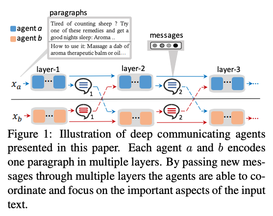
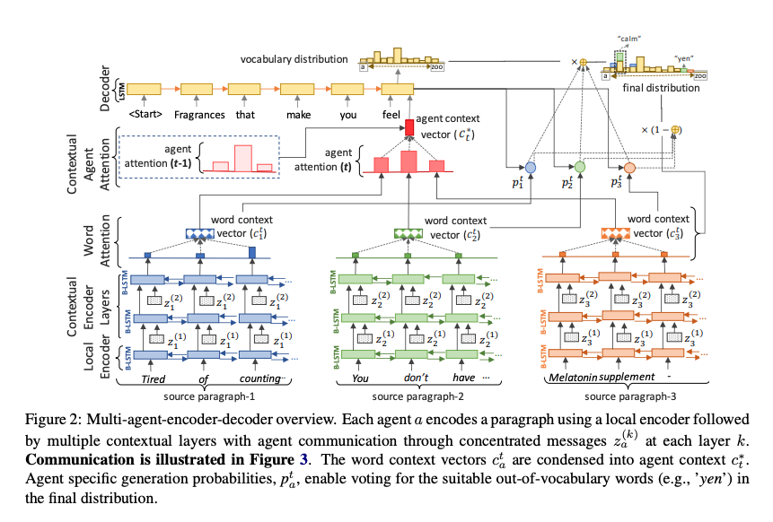
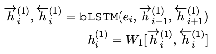
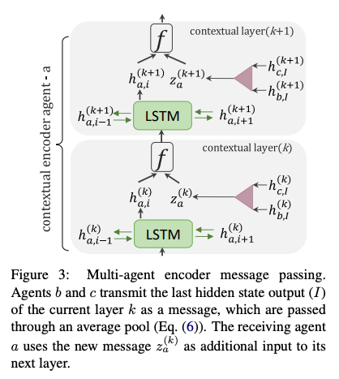
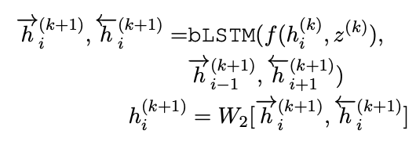

# Deep Communicating Agents for Abstractive Summarization paragraphs(2018)

## 1. Introduction

* 짧은 텍스트에서 좋은 결과를 내는 모델들이 긴 문서에 일반화되지 못하는 문제점이 있다.
  * 이를 해결하기 위해 input의 각각 다른 파트에 dynamic하게 attend하는 방법을 고안했다.

 
  

* multiple collaborating encoder agent들을 이용해 긴 문서들을 인코딩하는 task를 나눠서 진행한다.
  * 각 에이전트들은 그들에게 할당된 텍스트를 독립적으로 인코딩
  * 인코딩한 정보들을 다른 에이전트들에게 전달해 문서에 대한 global 문맥 정보를 공유하도록 한다.
  * 모든 에이전트들은 global 문맥 정보를 토대로 자신이 인코딩한 정보를 반복해서 multiple layer에 전달한다.,

 
  

* 에이전트가 인코딩을 끝내면 contextual agent attention과 함께 그 정보를 디코더에게 전달한다. (figure 2)
  * contextual agent attention은 디코더가 여러개의 에이전트들의 정보들을 각 디코딩 단계에서 스무스하게 통합할 수 있도록 만들어준다.

* 네트워크는 self-critical reinforcement learning을 사용해 end-to-end로 학습된다.

## 2. Model

* Sukhbaatar et al.(2016)의 CommNet 모델을 확장해서 사용

#### Notation

* 각 document d는 paragraphs x_a의 시퀀스(a = , ..., M)
  * 각 paragraph는 multiple encoding agents에 의해 split 되었음.
  * eg) agent-1은 paragraph x1을, agent-2는 paragraph x2를 인코딩한다.
* 각 paragraph 는 I개의 단어 시퀀스로 이뤄져 있음.
  * training document에서 빈번하게 나타나는 단어들에 대해 V-sized 단어 사전을 만듬
  * 각 단어 는 n차원 벡터 로 임베딩 되어 있음.
* 모든 변수 W는 linear projection matrices

### 2.1 Multi-Agent Encoder

* 각 에이전트들은 두개로 쌓인 인코더를 이용해 단어 시퀀스를 인코딩한다.

1. Local Encoder

   * 각 agent a에 대한 로컬 인코더의 첫 레이어이다.

     * 대응하는 paragraph x_a에 대해 모든 토큰은 단일 레이어의 bi-LSTM으로 feed되어 다음과 같은 local encoder hidden states를 만들어 낸다: 

       
 
         
       

       * H: hidden state의 차원

   * local encoder 레이어의 output이 contextual encoder로 feed된다.

2. Contextual Encoder

   * 에이전트 간 communication이 잘 순환할 수 있도록 만들어주는 역할을 수행한다.
   * 각 contextual encoder의 output은 다른 에이전트에서 나온 global 문맥 정보를 기반으로 나온 representation이다.

   
 
     
   

   * 각 레이어 k=1, ..., K에서 agent a는 이전 레이어에서 받은 정보를 jointly하게 인코딩한다.(figure 3)

     * (k+1)번째 contextual layer의 각 셀은 3개의 input을 가지는 bi-LSTM
       * input:
         * 인접한 LSTM 셀에서 나온 hidden state들:  또는 
         * 이전 레이어에서 나온 hidden state: 
         * 다른 에이전트들에서 나온 message vector: 
       * output: 

   * 식:

     
 
       
     

     * i = 1, ..., I : 각 시퀀스의 토큰을 뜻한다.
     * message z(k)는 레이어 k에 있는 모든 에이전트로 부터 받은 output들의 평균이다.
       * 식: 
         * : 이 아닌 에이전트들의 k번째 contextual layer의 마지막 hidden state output
         * 다른 인코더 에이전트로부터 받은 메세지의 평균을 이용하지만, FF 모델이나 어텐션과 같은 parametric function을 이용해도 된다.
       * message z(k) 해당 문서의 이전 인코딩에 project 된다:  ...(7)
         * v1, W3, W4는 모든 에이전트가 공유하는 학습된 파라미터이다.
         * 식 (7)은 다른 에이전트들의 정보를 현재 paragraph 내 문맥 정보와 결합해주는 역할을 수행한다.
           * 이를 통해 현재 문맥과는 다른 주제를 가진 새로운 문맥에  대한 feature를 만들어 낼 수 있다.

   * 각 레이어에서 1) 에이전트는 다른 에이전트로부터 받은 정보를 이용해 자신의 representation을 수정하고 2) 업데이트한 정보를 다른 에이전트들에게 보낸다.

### 2.1 Decoder with Agent Attention

* 각 에이전트의 마지막 contextual 인코더 레이어의 output 는 디코더로 전송되어 word-attention distribution을 계산하는데 사용된다.
  * : 각 token i에 대한 hidden state vector 시퀀스

* 디코더로는 single-layer LSTM을 사용하며, 가장 첫 agent의 마지막 hidden state 를 initial state로 가진다.

* 각 시각 t에서 디코더는 summary wt의 새로운 단어를 예측하고, 에이전트에 의해 제공된 input 문맥에 attend함으로써 새로운 state st를 계산

* hierarchical attention mechanism을 사용한다.

  * 에이전트 a에서 모든 토큰 에 대해 word attention distribution 를 계산한다.

    
 
      
    

    

    * : paragraph xa의 모든 토큰에 대한 attention
    * v2, W5, W6, b1: learned parameters

* 디코더 step t에서 각에이전트에 대해 새로운 디코더 context가 계산된다.