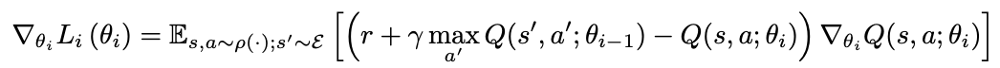

# Playing Atari with Deep Reinforcement Learning(2013)

## 1. Introduction

* 그동안 RL에서  input에서 directly하게 agent control을 학습하기 위해서는 hand-crafted feature + 선형함수 or policy representation에 의존해 왔다.
* 최근 딥러닝 분야가 발전하면서 raw data에서  hige-level feature을 추출하는 것이 가능해짐.
  * 그렇다면 딥러닝을 RL에 적용시킬 수 있지 않을까?
* 하지만 RL에 딥러닝을 적용시키는데는 몇가지 제약이 있다.
  * 딥러닝은 대규모의 라벨링 된 데이터로부터 진행
    * RL은 scalar reward로부터 학습 => 이는 sparse하고 노이즈를 만들어내며 바로 학습이 되지 않고 delay 되는 경향이 있다.
    * 특히 delay는 action과 result reward 사이가 많이 멀어서 발생하는데, 지도학습에서 input-output이 직접 비교되며 학습이 되는 딥러닝과는 차이를 보인다.
  * 대부분의 딥러닝에서는 데이터들이 독립적이다.
    * 하지만 RL에서는 state들이 서로 연관되어 sequence를 가진다.
  * 딥러닝은 고정된 data distribution을 가지지만, RL은 학습이 진행되면서 데이터 분포가 달라진다.
* 본 논문에서는 복잡한 RL 환경에서 raw video data를 input으로 하는 control policy를 학습하는 방법을 제시한다.
  * CNN을 사용
  * Q-Learning 알고리즘의 variant를 이용해 학습
  * SGD를 이용해 weight update
  * 위에 언급했던 correlated data & non-stationary 분포 문제 해결하기 위해 **experience replay mechanism** 사용
    * experience replay mechanism: 이전의 transition들에 대해 랜덤하게 샘플링 해 다양한 과거의 behavior에 대한 분포를 스무딩 하는 방법

* 본 논문의 목표는 가능한 한 많은 게임을 실행할 수 있는 **single neural network agent**를 만들어 내는 것.
  * 네트워크는 game에 대한 세부적인 정보는 알지 못함
  * hand-designed feature X
  * 기존의 RL처럼 input, reward, terminal state, action만 가지고 학습을 진행한다.
  * 네트워크 구조와 하이퍼 파라미터는 constant

i

## 2. Background

* task는 Agent가 상호작용하는 environment E(Atari emulator), action 시퀀스, observation, reward로 이뤄져 있다.
  * 각 step마다 agent는 가능한 action 집합 A={1, ..., K}에서 action 를 선택한다.
    * 이에 따라 emulator의 internal state와 game score가 갱신된다.
  * Agent는 emulator의 internal state를 관측할 순 없지만, 대신 image  를 관측한다.
    * image  : raw pixel vector
  * 게임스코어의 변화를 나타내는 reward  도 관측한다.
    * 게임 스코어는 전체 prior sequence of action과 observation에 의해 결정된다.
  * action에 대한 피드백은 수많은 step이 진행되고 난 뒤에야 받을 수 있다.
* Agent => 현재 시각의 이미지만 관측할 수 있기 때문에 task는 partially observed하며 많은 state들은 가려져 있다.
  * eg) 현재 input인 에서 상황을 fully understand하는 것은 불가능
  * 그래서  action sequence와 observation의 시퀀스인  을 이용해 game strategies를 학습
    * 모든 시퀀스는 finite number of time-step에서 terminate 되도록 가정한다.
    * 각 시퀀스가 distint state를 의미한다는 점에서 MDP로 이해할 수 있다.
* 따라서 본 논문에서는 시각 t에서의 complete sequeuce  을 사용해 MDP를 이용한 RL 학습 방법을 적용한다.

* Agent의 목표는 future reward를 최대화할 수 있도록 emulator와 상호작용하면서 action을 선택한다.

* Standard Assumption: 

  * 각 시각마다 future reward는 γ 에 의해 감소한다.

  * 시각 t에서 future discounted return은 다음과 같이 정의한다:

    

    * T: 게임이 종료되는 시각

* optimal action-value function Q*(s, a): sequence s을 보고 action a을 취하는 strategy를 수행했을 때 얻을 수 있는 최대 기대 반환값

  

  * π: policy

  * 이 action-value function은 Bellman equation을 따른다.

    * 만약 sequence s'에 대해 다음 time-step의 모든 가능한 action a'에 대해 optimal value Q\*(s', a')을 알 수 있는 경우, a'를 선택하는 optimal strategy는 *r + γQ\*(s', a')*의 기대값을 최대화하는 것이 된다.

      

* Basic idea behind many RL learning algorithms: 벨만 방정식을 iterative하게 업데이트하며 action-value function을 추정하는 것

  

  * 이러한 value iteration 알고리즘은 optimal action-value로 수렴하게 된다

    

    * 하지만 action-value function은 각 sequence에 대해 일반화하지 않고 따로 추정되기 때문에 실용적이지 않다.

  * 따라서 보통은 function approximator를 사용해 action-value function을 추정한다.

    

    * 보통은 linear function approximator를 사용
    * non-linear function approximator를 대신 사용하기도 함 ex) neural network

* 본 논문에서는 neural network function approximator를 사용

  * weights θ를 사용하는 Q-network

  * Q-network는 각 iteration i의 loss function  의 시퀀스를 최소화 함으로써 학습할 수 있다.

    

    * iteration i일 때 
      * target 
      * behaviour distribution ρ(s, a): sequence s와 action a일 때 확률 분포

  * Loss function 최적화 시 이전 시각의 parameter 는 고정된다.

* Target은 network weight에 따라 결정된다

  * 학습이 시작되기 전 target이 결정되는 기존의 supervised learning과는 다르다.

* weight에 대해 loss function을 미분해 다음과 같은 gradient를 얻을 수 있다:

  
 
    
  

* 또한 본 논문의 알고리즘 특징

  *  model-free
    * environment에 해당하는 emulator의 extimate를 만들어내지 않고, emulator에서 바로 샘플을 뽑아 문제를 해결한다.
  * off-policy
    * 학습을 수행하는 policy는 단순 greedy strategy 
    * 행동을 수행하는 policy는 ε-greedy strategy
      * ε 의 확률로 랜덤 action을, 1-ε 의 확률로 greedy strategy를 따르는 방식
      * state space에 대한 충분한 exploration을 가지는 behavior distribution을 가질 수 있도록 만들어 준다.

## 3. Related Work

* TD-gammon
  * 논문의 시점에서 가장 성고적인 RL 알고리즘
  * backgammon playing program을 RL과 self-play를 이용해 학습한 알고리즘으로 human-level에 도달함
  * Q-Learning과 비슷한 model-free RL을 사용했으며 하나의 hidden layer를 가지는 multi-layer perceptron을 사용해 value function을 approximate
  * 하지만 해당 게임 외의 다른 task에서 좋지 않은 성능을 보였기 때문에 backgammon game에 대해서만 효과적이라고 알려졌음
    * dice roll의 stochasticity가 state space를 탐험하는데 효과적으로 작용 + value function 스무딩