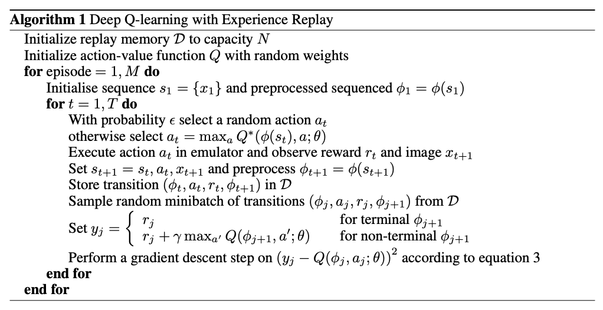
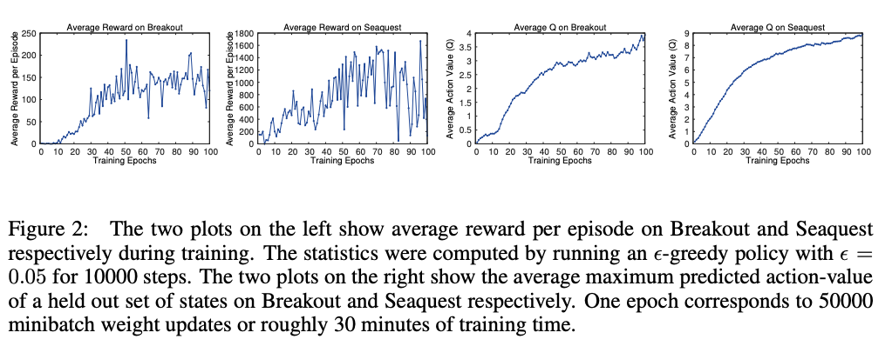
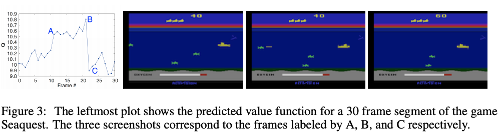
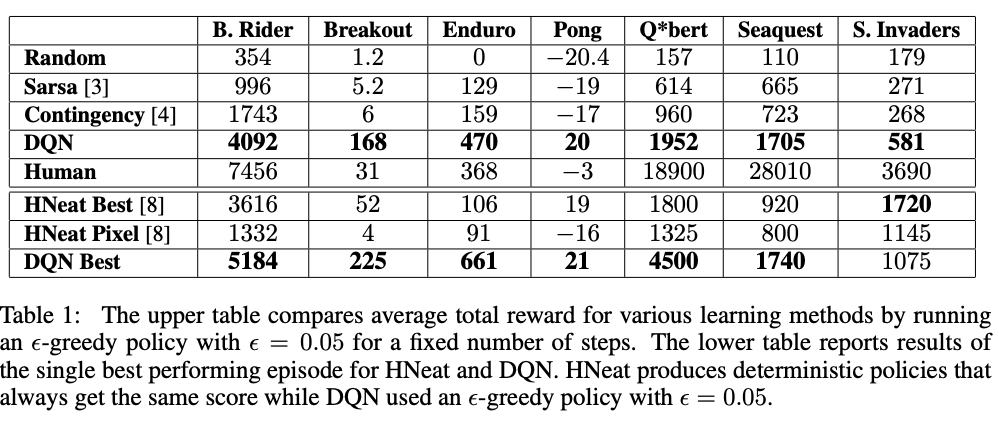

# Playing Atari with Deep Reinforcement Learning(2013)

## 1. Introduction

* 그동안 RL에서  input에서 directly하게 agent control을 학습하기 위해서는 hand-crafted feature + 선형함수 or policy representation에 의존해 왔다.
* 최근 딥러닝 분야가 발전하면서 raw data에서  hige-level feature을 추출하는 것이 가능해짐.
  * 그렇다면 딥러닝을 RL에 적용시킬 수 있지 않을까?
* 하지만 RL에 딥러닝을 적용시키는데는 몇가지 제약이 있다.
  * 딥러닝은 대규모의 라벨링 된 데이터로부터 진행
    * RL은 scalar reward로부터 학습 => 이는 sparse하고 노이즈를 만들어내며 바로 학습이 되지 않고 delay 되는 경향이 있다.
    * 특히 delay는 action과 result reward 사이가 많이 멀어서 발생하는데, 지도학습에서 input-output이 직접 비교되며 학습이 되는 딥러닝과는 차이를 보인다.
  * 대부분의 딥러닝에서는 데이터들이 독립적이다.
    * 하지만 RL에서는 state들이 서로 연관되어 sequence를 가진다.
  * 딥러닝은 고정된 data distribution을 가지지만, RL은 학습이 진행되면서 데이터 분포가 달라진다.
* 본 논문에서는 복잡한 RL 환경에서 raw video data를 input으로 하는 control policy를 학습하는 방법을 제시한다.
  * CNN을 사용
  * Q-Learning 알고리즘의 variant를 이용해 학습
  * SGD를 이용해 weight update
  * 위에 언급했던 correlated data & non-stationary 분포 문제 해결하기 위해 **experience replay mechanism** 사용
    * experience replay mechanism: 이전의 transition들에 대해 랜덤하게 샘플링 해 다양한 과거의 behavior에 대한 분포를 스무딩 하는 방법

* 본 논문의 목표는 가능한 한 많은 게임을 실행할 수 있는 **single neural network agent**를 만들어 내는 것.
  * 네트워크는 game에 대한 세부적인 정보는 알지 못함
  * hand-designed feature X
  * 기존의 RL처럼 input, reward, terminal state, action만 가지고 학습을 진행한다.
  * 네트워크 구조와 하이퍼 파라미터는 constant

## 2. Background

* task는 Agent가 상호작용하는 environment E(Atari emulator), action 시퀀스, observation, reward로 이뤄져 있다.
  * 각 step마다 agent는 가능한 action 집합 A={1, ..., K}에서 action 를 선택한다.
    * 이에 따라 emulator의 internal state와 game score가 갱신된다.
  * Agent는 emulator의 internal state를 관측할 순 없지만, 대신 image  를 관측한다.
    * image  : raw pixel vector
  * 게임스코어의 변화를 나타내는 reward  도 관측한다.
    * 게임 스코어는 전체 prior sequence of action과 observation에 의해 결정된다.
  * action에 대한 피드백은 수많은 step이 진행되고 난 뒤에야 받을 수 있다.
* Agent => 현재 시각의 이미지만 관측할 수 있기 때문에 task는 partially observed하며 많은 state들은 가려져 있다.
  * eg) 현재 input인 에서 상황을 fully understand하는 것은 불가능
  * 그래서  action sequence와 observation의 시퀀스인  을 이용해 game strategies를 학습
    * 모든 시퀀스는 finite number of time-step에서 terminate 되도록 가정한다.
    * 각 시퀀스가 distint state를 의미한다는 점에서 MDP로 이해할 수 있다.
* 따라서 본 논문에서는 시각 t에서의 complete sequeuce  을 사용해 MDP를 이용한 RL 학습 방법을 적용한다.

* Agent의 목표는 future reward를 최대화할 수 있도록 emulator와 상호작용하면서 action을 선택한다.

* Standard Assumption: 

  * 각 시각마다 future reward는 γ 에 의해 감소한다.

  * 시각 t에서 future discounted return은 다음과 같이 정의한다:

    

    * T: 게임이 종료되는 시각

* optimal action-value function Q*(s, a): sequence s을 보고 action a을 취하는 strategy를 수행했을 때 얻을 수 있는 최대 기대 반환값

  

  * π: policy

  * 이 action-value function은 Bellman equation을 따른다.

    * 만약 sequence s'에 대해 다음 time-step의 모든 가능한 action a'에 대해 optimal value Q\*(s', a')을 알 수 있는 경우, a'를 선택하는 optimal strategy는 *r + γQ\*(s', a')*의 기대값을 최대화하는 것이 된다.

      

* Basic idea behind many RL learning algorithms: 벨만 방정식을 iterative하게 업데이트하며 action-value function을 추정하는 것

  

  * 이러한 value iteration 알고리즘은 optimal action-value로 수렴하게 된다

    

    * 하지만 action-value function은 각 sequence에 대해 일반화하지 않고 따로 추정되기 때문에 실용적이지 않다.

  * 따라서 보통은 function approximator를 사용해 action-value function을 추정한다.

    

    * 보통은 linear function approximator를 사용
    * non-linear function approximator를 대신 사용하기도 함 ex) neural network

* 본 논문에서는 neural network function approximator를 사용

  * weights θ를 사용하는 Q-network

  * Q-network는 각 iteration i의 loss function  의 시퀀스를 최소화 함으로써 학습할 수 있다.

    

    * iteration i일 때 
      * target 
      * behaviour distribution ρ(s, a): sequence s와 action a일 때 확률 분포

  * Loss function 최적화 시 이전 시각의 parameter 는 고정된다.

* Target은 network weight에 따라 결정된다

  * 학습이 시작되기 전 target이 결정되는 기존의 supervised learning과는 다르다.

* weight에 대해 loss function을 미분해 다음과 같은 gradient를 얻을 수 있다:

  
 
    
  

* 또한 본 논문의 알고리즘 특징

  *  model-free
    * environment에 해당하는 emulator의 extimate를 만들어내지 않고, emulator에서 바로 샘플을 뽑아 문제를 해결한다.
  * off-policy
    * 학습을 수행하는 policy는 단순 greedy strategy 
    * 행동을 수행하는 policy는 ε-greedy strategy
      * ε 의 확률로 랜덤 action을, 1-ε 의 확률로 greedy strategy를 따르는 방식
      * state space에 대한 충분한 exploration을 가지는 behavior distribution을 가질 수 있도록 만들어 준다.

## 3. Related Work

* TD-gammon
  * 논문의 시점에서 가장 성고적인 RL 알고리즘
  * backgammon playing program을 RL과 self-play를 이용해 학습한 알고리즘으로 human-level에 도달함
  * Q-Learning과 비슷한 model-free RL을 사용했으며 하나의 hidden layer를 가지는 multi-layer perceptron을 사용해 value function을 approximate
  * 하지만 해당 게임 외의 다른 task에서 좋지 않은 성능을 보였기 때문에 backgammon game에 대해서만 효과적이라고 알려졌음
    * dice roll의 stochasticity가 state space를 탐험하는데 효과적으로 작용 + value function 스무딩

* model-free RL 알고리즘(ex. Q-Learning)에 non-linear function approximator나 off-policy와 결합하는 것은 Q-network가 발산하도록 만든다.

  * 따라서 대부분의 RL 연구는 좀 더 잘 수렴할 수 있도록 linear function approximator에 초점이 맞춰져 있다.

* 최근 들어서 강화학습에 딥러닝을 결합하려는 시도가 많이 일어나고 있다.

  * DNN은 그동안 environment를 추정하는데 사용되어져 왔다.
    * restricted Boltzmann machine: value function이나 policy를 측정하는데 사용됨
  * 그동안 Q-Learning에서 발생했던 발산 문제는 gradient temporal-difference 때문이라고 설명되어져 왔다.
    * 이 문제는 nonlinear function approximator를 사용해 fixed policy를 evaluate하거나
    * Q-learing의 restricted variant를 이용한 linear function approximation을 사용해 control policy를 학습하게 되면 해결된다고 증명되었다.
    * 하지만 아직 위의 방법들은 nonlinear control에는 적용된 적이 없다.

* 본 논문과 가장 유사한 기존 연구는 neural fitted Q-Learning(NFQ)이다.

  * NFQ: Q-network의 parameer를 업데이트하기 위해 RPROP 알고리즘을 사용해 아래 loss function식을 최적화하는 기법

    
 
      
    

    * 이 기법은 batch update를 사용하기 때문에 iteration 당 계산량이 데이터셋에 비례해서 커진다.
      * 이에 반해 본 논문의 기법은 SGD를 이용해 계산량을 줄였다.

  * 처음으로 deep autoencoder를 이용해 low dimensional representation을 학습했으며, 이 representation에 NFQ를 적용해 실제 visual input을 이용한 real-word control task에 성공적으로 작동했다.

    * 이에 반해 본 논문에서는 강화학습을 visual input에 직접적으로 end-to-end로 적용해 action-value를 구별하는데 사용되는 feature들을 학습할 수 있도록 만들었다.
    * 기존의 Q-learning 또한 experience replay와 simple neural network와 결합되어 사용된 적이 있지만, 실제 raw visual input 대신 low-dimensional state를 사용했다.

## 4. Deep Reinforcement Learning

* 본 논문의 목표: 1) RGB 이미지를 바로 처리할 수 있도록 강화학습과 DNN을 결합하고 2) SGD를 이용해 training data를 효과적으로 처리
* *experience replay*: 각 시각마다 data-set Ɗ = e1, ..., eN에 agent의 experience 를 저장해 *replay memory*에 episode를 저장해 놓는 방식
  * 매 iteration 마다 :
    * data-set 내 저장되어져 있는 experience 샘플들을 랜덤으로 뽑아 Q-learning update나 minibatch update를 적용한다.
    * experience replay 수행 후 agent는 ε-greedy policy를 이용해 action을 선택하고 수행한다.
  * 길이가 정해지지 않은 history를 NN의 input으로 사용하는 것이 어렵기 때문에 이 논문의 Q-function은 function Φ를 이용해 고정 길이로 history에 대한 representation을 만들어 계산한다.

 
  

* Deep Q-Learning
  * 기존의 online Q-learning과 비교했을 때 다음과 같은 장점을 가진다.
    1. 각 experience의 step이 잠재적으로 많은 weight update에 이용되기 때문에 데이터 효율성 면에서 좋다.
    2. 연속된 샘플들은 강한 상관관계를 가지기 때문에 바로 그것들을 가지고 바로 학습을 진행하는 것은 효과적이지 않다.
       * 샘플들을 랜덤으로 선택함으로써 상관관계를 깨뜨리고, 결과적으로 update 과정의 variance를 낮출 수 있다.
    3. on-policy로 학습하는 경우, 현재의 parameter들이 학습된 다음에 다음 데이터 샘플을 결정하게 된다.
       * ex) maximizing action이 'move left'일 때, training sample들은 왼쪽의 샘플들로만 이뤄지게 될 것이다. 
       * 이렇게 되면 예상치 못한 feedback loop가 발생하게 되며, parameter들이 local minimum에 빠지거나 발산하는 경우가 발생한다.
       * experience replay를 사용해 과거 state에 대해 평균을 낸 behavior distribution 만들어낼 수 있으며 learning을 스무딩시켜 parameter에 대한 oscillation이나 divergence을 막을 수 있다.
         * experience replay를 사용할 때에는 off-policy learning을 사용해야 한다.
           * behavior policy(generate the sample)와 target policy(current parameter)가 다르기 때문.
  * 가장 최근에 발생한 N개의 experience tuple만 replay memory에 저장하고, update 시 랜덤으로 Ɗ에서 샘플을 뽑는다.
    * 하지만 이런 방식은 메모리 버퍼가 **중요한 transition**을 고려하지 않고 가장 최신의 episode를 사용해 모리를 오버라이트 한다는 점에서 한계가 있다.
    * uniform sampling을 이용해 replay memory 내 모든 transition에 대해 동일한 중요성을 부여한다.
      * 좀 더 정교한 sampling strategy를 사용한다면 prioritized sweeping 기법 처럼 좀 더 가중치가 높은 중요한 transition을 뽑아낼 수 있을 것이다.

### 4.1 Preprocessing and Model Architecture

* raw Atari frame: 210 * 160 with 128 color palette
  * 이것을 그대로 사용하는 것은 계산량 면에서 비효율 적이기 때문에 차원을 축소하는 전처리를 진행
    1. RGB => gray-scale로 변환하고 110*84로 down-sampling
    2. 84*84로 playing area를 crop
       * GPU를 이용한 2D convolution 수행 시 square 형식의 input이여야 하기 때문
  * <Algorithm 1>의 function Φ이 이 전처리 작업을 수행한다.
    * Q-function의 input을 만들어내기 위해 가장 최근의 4개의 프레임(4개의 프레임이 하나의 화면을 구성)에 대해 전처리를 진행하고 이를 저장해둔다.

* Neural network를 이용해 Q를 parameterizing하는 다양한 방식이 존재한다.
  * Q는 Q-value를 추정하기 위해 history-action pair를 scalar 값으로 매핑해두기 때문에 이전의 기법들에서는 이 history와 action을 neural network의 input으로 사용해왔다.
    * 각 action에 대한 Q-value를 계산하기 위해서는 separate forward pass가 필요하며, 이는 action의 갯수에 비례하는 계산량을 보여준다.
  * 따라서 DQN에서는 가능한 action에 대해 separate output unit을 두고, neural network의 input으로는 state representation(history)만 받는다.
    * output은 input으로 들어오는 state에서 수행 가능한 action의 Q-value가 된다.
    * 한번의 forward pass로 주어진 state에 대해 모든 가능한 action의 Q-value를 계산할 수 있기 때문에 효율적이다.

* 구조:

  
 
    
  

  

  * input: Φ를 통해 전처리 한 84\*84\*4 image
  * 첫번째 은닉층: 16개의 8*8 필터(stride=4)로 합성곱 연산 수행 후 rectifier non-linearity(ex. relu) 수행
  * 두번째 은닉층: 32개의 4*4 필터(stride=2)로 합성곱 연산 수행 후 rectifier non-linearity 수행
  * 마지막 은닉층: 256개의 rectifier unit으로 구성된 Fully-Connected layer
  * 출력층: 가능한 action에 대한 single output을 가지는 Fully-Connected linear layer
    * 가능한 action은 게임에 따라 4 ~ 18개

## 5. Experiments

* 7개의 ATARI game에 대해 실험 진행
  * Beam Rider, Breakout, Enduro, Pong, Q*bert, Seaquest, Space Invaders
  * 각 게임에 대해서는 동일한 네트워크 구조, 학습 알고리즘, 하이퍼 파라미터 사용
    * game-specific 정보 없이도 다양한 게임에 적용할 수 있음을 보임
  * 게임마다 score scale이 다르기 때문에 학습 시 각 게임별 reward structure만 수정
    * positive reward : 1 / negative reward: -1 / unchanged: 0
    * 게임들의 error derivative의 scale을 제한하고, 같은 학습율을 적용할 수 있음
    * 하지만 reward들 간 차이를 반영하지 못하기 때문에 학습에 영향을 줄 수도 있음
* minibatch = 32인 RMSProp 알고리즘 이용
* behavior policy: ε-greedy
  * 첫 100만개의 프레임까지는 0.1 간격으로 1에서 0.1로 ε값이 감소
  * 그 후로는 0.1로 고정
* 1000만개의 프레임으로 학습을 진행, replay memory는 가장 최근의 100만개의 프레임을 저장
* Simple frame-skipping technique 사용
  * 모든 프레임을 선택하는 것이 아니라 k의 배수번째 프레임을 선택
    * Space Invader를 제외한 모든 게임: k=4
    * Space Invader: k=3
  * 단순히 각 프레임을 선택하는 것이 skip하는 것 보다 계산량은 적지만, 런타임을 증가시키지 않고도 agent가 k배 많은 게임을 경험하도록 만들어준다.

### 5.1 Training and Stability

* Supervised Learning에서는 validation set을 이용해 학습 과정을 평가함으로써 performance에 대해 살펴볼 수 있지만, 강화학습에서는 실험 과정을 평가하는 것이 쉽지 않다.

* 따라서 이를 살펴보기 위해 두가지 metric을 사용해 실험을 진행해보았다.

  * 1) average reward와 2) average action value(Q)

  
 
    
  

  

  * 단순 Average Reward의 경우 policy의 weight가 조금만 달라져도 policy가 방문하는 state의 distibution이 크게 변할 수 있기 때문에 noisy
    * 왼쪽 그림 두개가 average reward
    * 따라서 evaluation metric으로 사용하기에는 적절하지 않아 보임
  * 하지만 본 논문에서처럼 Q값을 사용한 Average action-value의 경우 더 안정적인 결과를 보인다.
    * 오른쪽 그래프를 보면 Average Q값이 더 스무스하게 증가하고 있음을 볼 수 있다.

* 이론적으로는 Q가 수렴한다는 보장을 하지는 못하지만, 이 실험을 통해 NN을 사용한 것이 효과적임을 보였다.

  

### 5.2 Visualizing the Vaue Function

 
  

* Figure 3은 Seaquest에서 학습한 value function에 대한 시각화
  * point A: 스크린의 가장 왼쪽에 적이 등장함과 동시에 예측값이 급격히 상승
  * point B: Agent가 enemy를 향해 어뢰를 발사하고, 어뢰가 enemy를 맞추기 직전에 예측값이 가장 peak를 찍는다.
  * point C: enemy가 없어지자 예측값이 급격히 하락한다.
* 본 논문의 방법이 이벤트 시퀀스에 대해 reasonable한 value function을 학습해 내고 있다는 것을 보여준다.

### 5.3 Main Evaluation

 
  

* 강화학습에서 좋은 결과를 보여줬던 모델들을 사용해 성능을 비교했다.

  * Sarsa: Sarsa 알고리즘을 사용해 hand-engineered 된 Atari task의 feature들을 linear policy를 이용해 학습 + 가장 성능이 좋은 feature set의 점수를 report
  * Contingency: Sarsa와 같은 접근 방식을 사용하지만 agent control에 의한 screen representation을 feature set에 추가해 학습
  * Human: 각 게임을 두시간동안 플레이 한 후 얻은 reward의 중간값 사용
  * Random: random policy를 사용해 action 선택
  * Neuro-Evolution 알고리즘(RL X)
    * HNeat Best: hand-engineered object detector algorithm으로 output은 location과 object의 타입이 된다.
    * HNeat Pixel

  * 이 중 Q*bert, Seaquest, Space Invader를 제외하면 사람보다 더 좋은 결과를 보여줌.
    * 위의 세가지 게임은 긴 시간동안 진행하는 게임이기 때문에 네트워크가 strategy를 찾는데 어려움이 존재했다.

## 6. Conclusion

* Deep Learning 모델을 사용한 Reinforcement Learning 기법을 제안했다.
* RL의 deep network를 좀 더 쉽게 학습하기 위해 experience replay memory와 stochastic minibatch update를 결합한 online Q-learning 기법을 도입했다.
* 구조나 하이퍼파라미터의 수정 없이 7개 중 6개의 게임에 대해 sota 결과를 보였다.