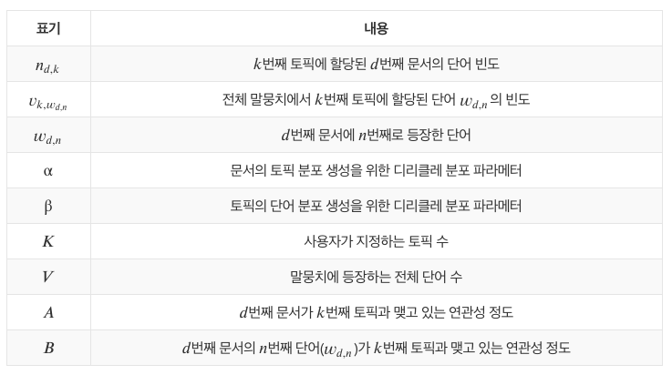

# Topic Modeling

## LDA(Latent Dirichlet Allocation)

### 모델 개요

* LDA: 주어진 문서에 대해 각 문서에 어떤 주제들이 존재하는지에 대한 확률 모형
  * 토픽별 단어의 분포, 문서별 토픽의 분포를 모두 측정
    * 특정 토픽에 특정 단어가 나타날 확률 계산
      * 말뭉치로부터 얻은 토픽 분포로부터 토픽 선정
      * 해당 토픽에 해당하는 단어 뽑기
      * => LDA가 가정하는 문서 생성 과정
  * LDA는 학습을 통해 어떤 단어가 어떤 토픽에서 뽑힌 단어인지에 대한 잠재 정보를 알아낸다.

### 모델 구조

* D: 말뭉치 전체 문서 개수 / K: 전체 토픽 수(하이퍼 파라미터) / N: d번째 문서의 단어 수
  * 네모 칸: 반복 / 동그라미: 변수

#### 변수

* : per-corpus topic distributions, k번째 토픽에 해당하는 벡터
  * 길이는 말뭉치 전체 단어 개수만큼
  * 벡터 내 각 요소들은 해당 단어가 k번째 토픽에서 차지하는 비중을 나타냄
  * 각 요소는 확률이므로 모든 요소의 합은 1이 된다!
  * 하이퍼 파라미터 β의 영향을 받음
    * LDA는 토픽의 단어 비중 이 디리클레분포를 따른다는 가정을 취하기 때문
* : per-document topic proportions, d번째 문서가 가진 토픽 비중 나타내는 벡터
  * 전체 토픽 개수 K만큼의 길이를 가짐
  * 각 요소값은 k번째 토픽이 해당 d번째 문서에서 차지하는 비중을 나타냄
  * 마찬가지로 확률이므로 모든 요소의 합은 1이 된다.
  * 하이퍼 파라미터 α의 영향을 받음
* : per-word topic assigment, d번째 문서의 n번째 단어가 어떤 토픽에 해당하는지 할당해주는 역할
* : 문서에 등장하는 단어를 할당해주는 역할

#### inference

* 를 가지고 잠재 변수를 역으로 추정하는 inference 과정을 살펴보자.
  * LDA => 토픽의 단어 분포와 문서의 토픽 분호의 결합으로 문서 내 단어들이 생성된다고 가정
  * 실제 관찰가능한 문서 내 단어를가지고 우리가 알고 싶은 토픽의 단어 분포, 문서의 토픽 분포를 추정하는 과정
* 토픽의 단어 분포와 문서의 토픽분포의 결합 확률이 커지도록 만들어야 한다.

  

* 𝑝(𝑧, ϕ, θ|𝑤)를 최대로 만드는 𝑧, ϕ, θ를 찾아야 한다!
  * 사후 확률을 계산하기 위해서는 분모에 해당하는 𝑝(𝑤)를 구해야 한다.
    * 베이즈 정리에서 evidence라 불리는 것으로 잠재 변수 𝑧, ϕ, θ의 모든 경우의 수를 고려한 각 단어(w)의 등장 확률을 가리킨다.
    * 하지만 현실적으로  𝑧, ϕ, θ는 직접 관찰하는게 불가능하며, 𝑝(𝑤)를 구할 때  𝑧, ϕ, θ의 모든 경우를 고려해야 함.
      * **깁스 샘플링** 같은 기법을 사용한다.

#### LDA와 깁스 샘플링

* collapsed gibbs sampling: 나머지 변수는 고정시킨 채 한 변수만을 변화시키되 일부 변수는 샘플링에서 제외하는 기법

  

  * w와 가 주어졌을 때, 문서의 i번째 단어의 토픽이 j일 확률
  * w: 말뭉치가 주어졌기 때문에 이미 알고있는 값
  * z: 각 단어가 어떤 토픽에 할당되어 있는지를 나태내는 변수
    * : i번째 단어의 토픽 정보를 제외한 모든 단어의 토픽 정보

* 계산과정
  * d번째 문서의 i번째 단어의 토픽 이 j번째 토픽에 할당 될 확률

* 모든 문서, 단어에 대해 깁스 샘플링 수행하면 모든 단어마다 토픽을 할당할 수 있으며, 이 과정에서 ϕ, θ 도 구할 수 있다.

#### 디리클레 파라미터

* d번째 문서에 i번째로 등장하는 단어의 토픽이 j일 확률:

  

  * A: d번째 문서가 j번째 토픽과 맺고 있는 연관성 정도 / B: d번째 문서의 n번째 단어(w_{d, n})가 j번째 토픽과 맺고 있는 연관성의 강도
  * 그렇다면 하이퍼파라미터 α, β의 역할은?

* 특정 토픽에 할당된 단어들이 없는 경우에도 값이 0으로 계산되는 것을 막는 smoothing 역할을 수행

  * α가 클수록 토픽들의 분포가 비슷해지고, 작을 수록 특정 토픽이 크게 나타나게 된다!

#### 최적 토픽 수 찾기

* 토픽 수 K는 사용자가 지정하는 하이퍼파라미터

* LDA에서 문서가 생성되는 과정 => 확률모형

  * LDA로부터 추정된 토픽 정보(z)를 활용해 계산한 각 단어의 발생 확률이 클수록 학습 코퍼스가 생성되는 과정을 제대로 설명한 것이 된다.
  * 최적 토픽 수를 찾기 위한 방법도 이 아이디어를 사용

* 모든 문서와 단어의 발생 확률 p(w)를 식으로 쓰면 다음과 같다:

  

  * 모든 문서 내 등장하는 여러 토픽에 해당하는 단어의 분포를 계산하기 위해 합을 계산

* 이를 이용한 Perplexity 지표는 다음과 같이 구한다:

  

### 구현

